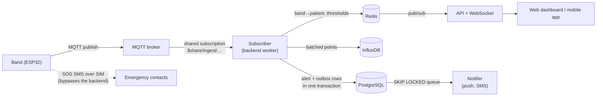
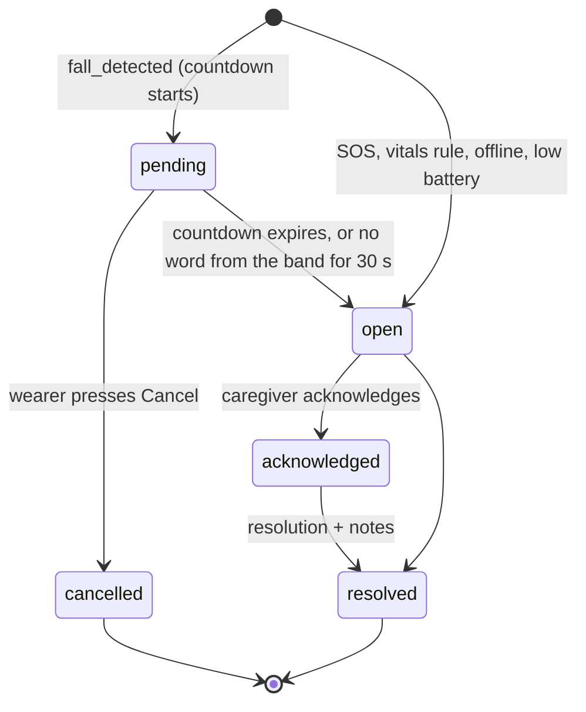
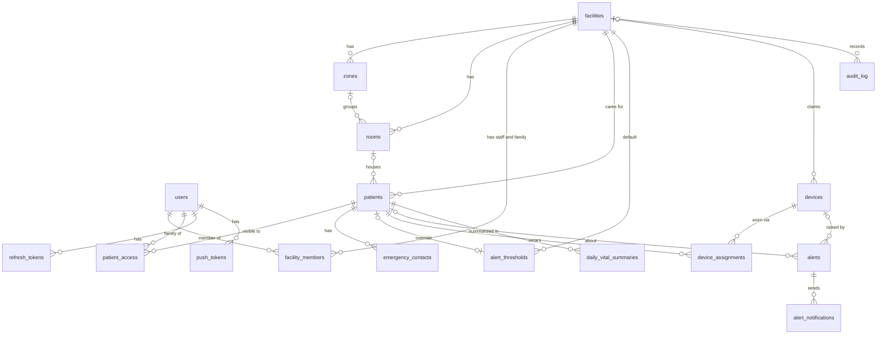

# S-Care database design

> **Status: proposal.** The backend still serves generated demo data, so nothing reads these stores yet. The PostgreSQL part is concrete: [`postgres/001_initial_schema.sql`](postgres/001_initial_schema.sql), with a test script in [`postgres/tests/`](postgres/tests/) that passes on PostgreSQL 16 and 17. The InfluxDB and Redis parts are specified here and get built along with the MQTT subscriber.

Sized for today — **under 50 users and 100 bands** — and shaped so that 10× and 100× are additive steps, not a rewrite (see [Scaling path](#scaling-path)).

---

## Who stores what

| Store | Holds | Why this store | If it's lost |
|---|---|---|---|
| **PostgreSQL** | Facilities, people, bands and who wears them, thresholds, alerts and their notifications, auth, audit log, daily vital summaries | Relations and constraints: an alert must never be lost, duplicated, or attached to the wrong patient | Restore from backup — this is the record |
| **InfluxDB** | Every vitals sample, battery/signal, location, and motion windows around falls | Append-only time series with cheap retention and downsampling | Raw samples expire by design; long-term history is also in Postgres |
| **Redis** | Latest reading per band, band→patient cache, check-in deadlines, rule timers, rate limits, live pub/sub | Sub-millisecond reads, TTLs, fan-out across API instances | Nothing — every key is rebuilt from Postgres/InfluxDB within a minute |

Two rules keep the split honest:

1. **Redis never holds the only copy of anything.**
2. **InfluxDB never holds anything you'd need to join on.** It stores IDs and numbers; names, rooms and relationships live in Postgres.

## Sizing

Assumes one vitals sample every 10 s per band, uploaded as one MQTT message per minute.

| | Today (100 bands) | Design point (10,000 bands) |
|---|---|---|
| Vitals samples | ~864k / day | ~86M / day |
| InfluxDB write volume | ~0.5 MB / 5 min | ~50 MB / 5 min |
| 1-minute rollup points | ~144k / day | ~14M / day |
| Alerts (assuming ≤ 0.5 per band per day) | ≤ 50 / day | ≤ 5,000 / day |
| `daily_vital_summaries` rows | ~36k / year | ~3.6M / year |
| PostgreSQL size, year one | well under 1 GB | a few GB |

**Don't store a continuous motion stream.** The MPU6050 at 50 Hz across just 100 bands is 432M points/day — five times the vitals volume of 10,000 bands — and it would drain both the battery and the SIM. Motion is stored only as ~10 s windows around fall events.

---

## Ingest path



For each message the subscriber:

1. **Resolves context** — band → patient → facility — from Redis, falling back to Postgres. The assignment used is the one valid at the **sample's** timestamp, so a batch uploaded late (after deep sleep or a Wi-Fi outage) still lands on the right patient, even if the band has since been given to someone else.
2. **Drops unusable samples** — below the sensor's confidence cut-off (`quality`), or timestamped outside *[received − 24 h, received + 2 min]*. ESP32 clocks drift in deep sleep; out-of-range samples fall back to arrival time and are flagged.
3. **Writes points** to InfluxDB in batches (flush every 1 s or 5,000 points).
4. **Updates Redis** — the band's latest reading and its next check-in deadline.
5. **Evaluates rules** against the patient's effective thresholds.
6. **On a new alert**, inserts the alert and its notification rows in one Postgres transaction, then publishes to Redis *after* commit.

The subscriber keeps no state of its own, so two or ten of them can share the broker subscription with no code change.

### Rules

| Alert | Fires when | Severity |
|---|---|---|
| `tachycardia` / `bradycardia` | HR past the warn bound for `sustain_seconds`, or past the critical bound on 2 consecutive samples | warning → critical (the open alert is escalated in place) |
| `hypoxemia` | SpO₂ below the warn bound for `sustain_seconds`, or below critical on 2 consecutive samples | warning → critical |
| `low_battery` | battery at or below warn / critical % | info → warning |
| `offline` | band misses its check-in deadline (2 × `heartbeat_interval_s`) | warning; auto-resolved when it reports again |
| `fall` | band publishes `fall_detected` | critical |
| `sos` | band publishes `sos` | critical |

Requiring two consecutive critical samples rejects a single motion-artifact reading while delaying a real emergency by only one sample interval.

### Fall lifecycle

The band verifies falls in two layers: a 15-second countdown the wearer can cancel. The alert tracks that:



If the band goes silent mid-countdown, the backend opens the alert anyway — the safe default. Cancelled falls are kept: they're the false-alarm data for tuning the three-stage detection algorithm, and every "active" query excludes them.

### MQTT topics

| Topic (`{uid}` = `devices.device_uid`) | Direction | QoS | Content |
|---|---|---|---|
| `scare/devices/{uid}/vitals` | band → broker | 0 | batch of samples |
| `scare/devices/{uid}/status` | band → broker | 0 | battery, charging, RSSI, network, worn |
| `scare/devices/{uid}/location` | band → broker | 0 | lat/lon, accuracy, source |
| `scare/devices/{uid}/events` | band → broker | 1 | `fall_detected`, `fall_cancelled`, `fall_confirmed`, `sos` — each with an `incident_id` |
| `scare/devices/{uid}/motion` | band → broker | 1 | IMU window around a fall, same `incident_id` |
| `scare/devices/{uid}/config` | broker → band | 1, retained | emergency-contact numbers + `config_version` |
| `scare/devices/{uid}/ack` | band → broker | 1 | `{"config_version": n}` |

- **QoS 0 for telemetry, QoS 1 for events.** A lost vitals sample is harmless; a lost SOS isn't. QoS 1 can deliver twice, so `alerts` has `UNIQUE (device_id, device_event_id)` and a replay does nothing.
- **Contacts reach the band as retained config.** The SIM's SMS fallback never touches the backend, so the band must carry the numbers itself. It receives changes on its next connect even if it was asleep. `config_version` vs `config_acked_version` on `devices` lets the dashboard warn when a band is carrying stale numbers.
- **Broker ACL:** a band may only publish under its own `scare/devices/{uid}/` and read its own `config`. Only the backend's account subscribes to all bands.
- **Deep sleep vs. a persistent connection.** A band that sleeps between readings reconnects on every wake, which erodes MQTT's cost advantage. Keep wakes coarse (a minute of samples per upload), use a persistent session (`clean_start = false`) and TLS session resumption. Last Will messages can't detect a *graceful* sleep disconnect, so offline detection uses Redis deadlines instead.

Example `vitals` payload — short keys, in case telemetry ever travels over the SIM:

```json
{ "v": 1, "t0": 1757600000000, "dt": 10000,
  "hr":   [74, 75, 73, 76, 74, 75],
  "spo2": [98, 98, 97, 98, 98, 98],
  "q":    [92, 90, 95, 91, 93, 94] }
```

---

## PostgreSQL

Requires **PostgreSQL 15+** (tested on 16 and 17) with the `citext` and `btree_gist` extensions, which ship with PostgreSQL.

```bash
psql "$DATABASE_URL" -v ON_ERROR_STOP=1 -f database/postgres/001_initial_schema.sql

# tests: run against a throwaway database, never production
createdb scare_test
psql -d scare_test -v ON_ERROR_STOP=1 -f database/postgres/001_initial_schema.sql
psql -d scare_test -v ON_ERROR_STOP=1 -f database/postgres/tests/001_initial_schema.test.sql
```



### Tables

| Group | Table | Purpose |
|---|---|---|
| Places | `facilities` | A care home **or** a single private home — the product serves both. Every tenant-scoped row carries `facility_id`. |
| | `zones`, `rooms` | "Room 112 • West Wing" |
| People | `users` | A login identity, with no role of its own |
| | `facility_members` | Role per facility — `admin`, `caregiver` or `family`. One person can belong to two homes. |
| | `patient_access` | Which patients a `family` member may see. Admins and caregivers see the whole facility. |
| | `patients` | Never hard-deleted: `discharged_at` ends a stay and the history stays attached |
| | `emergency_contacts` | The numbers the band texts on SOS, in `priority` order (1 = primary) |
| Bands | `devices` | One row per physical band, created at provisioning. `facility_id` is set when a facility claims it by QR. |
| | `device_assignments` | Who wore which band, and when — time ranges rather than a `patient_id` on `devices` |
| Alerting | `alert_thresholds` | One facility default row plus optional per-patient overrides. A `NULL` column inherits. |
| | `effective_alert_thresholds` *(view)* | Override → facility default → built-in default (mirrors S-Care Mobile's `AppConstants`) |
| | `alerts` | Every incident, a snapshot of its moment, and who handled it and how |
| | `alert_notifications` | Each push/SMS attempt — and the notifier's work queue |
| Auth | `refresh_tokens` | Hashed, rotating, revocable. Access tokens stay short-lived stateless JWTs. |
| | `push_tokens` | FCM tokens for the mobile app |
| Record | `audit_log` | Who viewed or changed what — expected for health data |
| | `daily_vital_summaries` | One row per patient per day, kept forever |

Live band status (online / offline / warning / critical) is **derived**, not stored: Redis deadlines say online/offline, open alerts say warning/critical.

### What the database enforces, so application bugs can't break it

- **One band per patient and one patient per band, at every moment of history.** Exclusion constraints on assignment time ranges, so "who wore band X at 03:12 last Tuesday?" always has exactly one answer.
- **No cross-facility references.** Rooms, patients, thresholds, assignments and alerts can't point at another facility's rows (composite foreign keys on `(facility_id, id)`). A band can't be assigned outside the facility that claimed it, or moved to another facility while assigned (triggers).
- **No alert storms.** At most one *active* vitals alert per patient per type, and one active `offline` or `low_battery` alert per band (partial unique indexes) — even if Redis is flushed. Falls and SOS always open a new incident.
- **Idempotent device events.** `UNIQUE (device_id, device_event_id)` makes MQTT redelivery a no-op.
- **A consistent lifecycle.** `resolved` if and only if `resolved_at` is set, and always with a `resolution` (`assisted`, `false_alarm`, `no_action_needed`). `pending` exists only for falls.
- **Valid contacts.** E.164 phone numbers; unique SMS priority per patient, swappable in one `UPDATE`.
- **Topic-safe band IDs.** `device_uid` is part of the MQTT topic, so `/`, `+` and `#` are rejected.

### Hot-path queries

```sql
-- Ingest: which patient wore this band when the sample was taken? (uses the exclusion index)
SELECT patient_id, facility_id
FROM device_assignments
WHERE device_id = $1
  AND tstzrange(assigned_at, unassigned_at) @> $2::timestamptz;

-- Rules: open an alert unless one of this type is already active
INSERT INTO alerts (facility_id, patient_id, device_id, type, severity, source, occurred_at, heart_rate_snapshot, details)
VALUES ($1, $2, $3, 'tachycardia', 'warning', 'rules', $4, $5, $6)
ON CONFLICT DO NOTHING
RETURNING id;   -- no row back: already active, so escalate that one instead

-- Dashboard and Alerts page: the active feed (partial index alerts_active_idx)
SELECT *
FROM alerts
WHERE facility_id = $1
  AND status IN ('pending', 'open', 'acknowledged')
ORDER BY occurred_at DESC
LIMIT 50;

-- Notifier: claim queued notifications; safe with any number of workers
WITH next AS (
  SELECT id FROM alert_notifications
  WHERE status = 'queued'
  ORDER BY created_at
  LIMIT 20
  FOR UPDATE SKIP LOCKED
)
UPDATE alert_notifications n
SET attempts = n.attempts + 1
FROM next
WHERE n.id = next.id
RETURNING n.*;
```

Inserting an alert and its `alert_notifications` rows **in the same transaction** is the outbox pattern: if the process dies right after commit, the notifier still finds the queued rows. Delivery is at-least-once — a caregiver may occasionally get a duplicate push, never a missing one.

List endpoints paginate by keyset — `WHERE (occurred_at, id) < ($cursor_time, $cursor_id)` — instead of `OFFSET`, so page 500 costs the same as page 1.

### Conventions

- **IDs:** `uuid` via `gen_random_uuid()` — safe in URLs and QR flows, and no collisions if data is ever merged or sharded. On PostgreSQL 18, switch the defaults to `uuidv7()` for better index locality.
- **Time:** `timestamptz` everywhere. `daily_vital_summaries.day` is the facility's local date (`facilities.timezone`).
- **Status and type columns:** `text` with `CHECK`, not enum types — adding or retiring a value is a one-line migration.
- **Migrations:** numbered, forward-only SQL files in `database/postgres/`.

---

## InfluxDB

### Retention tiers

| Where | Retention | Contents | Serves |
|---|---|---|---|
| `scare_raw` bucket | 30 days | all measurements below | live monitor, charts up to 24 h, incident review |
| `scare_1m` bucket | 400 days | `vitals_1m`: 1-minute min / mean / max per patient | 7-day, 30-day and 1-year charts |
| Postgres `daily_vital_summaries` | forever | daily min / avg / max, worn minutes, steps | long-term trends and reports |

The last tier lives in Postgres because a year of daily rows for 100 patients is ~36k rows, and it means long-term history doesn't depend on the InfluxDB plan. Check the current InfluxDB Cloud free-tier limits before relying on the 400-day bucket; the free tier has historically capped retention at around 30 days. The design fits in two buckets.

Chart queries route by range: up to 24 h reads `scare_raw`, longer reads `scare_1m`, beyond 400 days reads Postgres.

### Measurements in `scare_raw`

| Measurement | Tags | Fields | Written |
|---|---|---|---|
| `vitals` | `facility_id`, `patient_id`, `device_id` | `heart_rate` int, `spo2` int, `quality` int (0–100), `accel_mag` float, `steps` int, `temperature` float *(optional)* | every sample (~10 s), uploaded in batches |
| `device_status` | `facility_id`, `device_id` | `battery_pct` int, `charging` bool, `rssi_dbm` int, `network` string (`wifi` / `cellular`), `worn` bool | every wake (~60 s) |
| `location` | `facility_id`, `patient_id`, `device_id` | `lat`, `lon`, `accuracy_m` float, `source` string (`gps` / `cell` / `wifi`) | on movement, at most every 5 min |
| `motion` | `facility_id`, `device_id` | `ax`, `ay`, `az`, `gx`, `gy`, `gz` float | only a ~10 s window at 50 Hz around a fall |

A band with no current assignment writes `device_status` only.

```text
vitals,facility_id=00000000-0000-4000-8000-00000000000a,patient_id=40000000-0000-4000-8000-000000000001,device_id=50000000-0000-4000-8000-000000000102 heart_rate=74i,spo2=98i,quality=92i,accel_mag=0.99 1757600000000
```

**Tag rules**

- **Tags are IDs only.** No names, rooms, or anything else that can change: a rename would split the series, and names in a time-series store are personal data that's hard to purge.
- **`patient_id` is fixed at write time**, from the assignment valid at the sample's timestamp. Charts query by `patient_id`, so a patient's history survives a band swap and the band's next wearer never inherits it.
- **Never tag unbounded values** — alert IDs, incident IDs, readings. That's how series cardinality explodes.
- **Precision `ms`**, with the timestamp from the band (validated as described in the ingest path).

### Downsampling

- **Every 10 minutes**, recompute 1-minute aggregates for the **trailing 2 hours** into `scare_1m`. A point with the same timestamp and tags overwrites, so re-running is safe, and the trailing window catches batches that bands uploaded late.
- **Nightly at 00:30 facility time**, write yesterday into `daily_vital_summaries` with `INSERT … ON CONFLICT (patient_id, day) DO UPDATE`.
- Run both as scheduled jobs in the backend worker. That works on any InfluxDB edition; native tasks exist on some editions but aren't portable across them.

---

## Redis

Every key is prefixed `scare:` so a shared instance stays tidy.

| Key | Type | TTL | Written by | Used for |
|---|---|---|---|---|
| `scare:dev:{uid}:ctx` | hash — `device_id`, `patient_id`, `facility_id`, `location_label`, `heartbeat_interval_s` | 1 h; deleted on reassignment | subscriber, from Postgres on a miss | every ingested message |
| `scare:pat:{patient_id}:thr` | hash — effective thresholds | 1 h; deleted when thresholds change | subscriber, from `effective_alert_thresholds` | rule evaluation |
| `scare:dev:{device_id}:latest` | hash — `hr`, `spo2`, `battery`, `rssi`, `worn`, `network`, `ts` | none (overwritten) | subscriber | dashboard and device list |
| `scare:fac:{facility_id}:deadlines` | sorted set — member `device_id`, score = next expected check-in (ms) | none | subscriber (`ZADD` per message) | offline sweeper every 15 s (`ZRANGEBYSCORE … -inf <now>`) |
| `scare:rule:{patient_id}:{rule}` | string — first-breach timestamp | 2 × sustain window | rules (`SET NX`; `DEL` on recovery) | sustained-threshold rules |
| `scare:evt:{device_id}:{event_id}` | string | 24 h | subscriber (`SET NX`) | cheap duplicate drop before Postgres, which is the real guarantee |
| `scare:rl:login:{ip}`, `scare:rl:login:{email}` | counter | 15 min | auth | brute-force protection |
| `scare:jwt:deny:{jti}` | string | remaining access-token lifetime | logout / revoke | auth middleware |
| `scare:fac:{facility_id}:dashboard` | JSON string | 5 s | dashboard endpoint | dashboard aggregate cache |

**Pub/sub channels**

- `scare:fac:{facility_id}:live` — vitals ticks, fanned out to WebSocket/SSE clients on every API instance.
- `scare:fac:{facility_id}:alerts` — an alert was created or changed. Published after the Postgres commit.

Pub/sub is fire-and-forget. That's fine here: a reconnecting client re-fetches over REST, because Postgres is the record. Anything that must not miss an event — the notifier — reads the Postgres outbox, not pub/sub.

**Surviving a flush.** Everything is rebuilt on demand, with one exception that needs care: a band that's already offline never sends a message, so it would never re-enter the deadline set. On startup, and whenever that set is missing, the sweeper seeds it from `devices.last_seen_at` — which is why the subscriber flushes `last_seen_at` to Postgres about once a minute. At 100 bands the whole keyspace is a few MB, so persistence is optional.

---

## Which store answers each endpoint

| Endpoint | Reads / writes |
|---|---|
| `GET /api/dashboard` | Redis `latest` for the facility's bands (one pipeline) + Postgres active-alert and patient counts; cached 5 s |
| `GET /api/alerts` | Postgres `alerts`, keyset-paginated; the active filter hits `alerts_active_idx` |
| `GET /api/alerts/stats` | Postgres `GROUP BY` type / severity / status over a time window |
| `POST /api/alerts` | Postgres alert (`source = 'manual'`) + `alert_notifications`, one transaction → Redis `PUBLISH` |
| `GET /api/devices`, `GET /api/devices/:id` | Postgres bands + current assignment, merged with Redis `latest` and online state |
| `GET /api/devices/:id/health` | InfluxDB — `scare_raw` up to 24 h, `scare_1m` beyond. Consider adding `GET /api/patients/:id/vitals`: history belongs to the patient, not the band. |
| `POST /api/devices/scan` | Postgres: verify the QR claim code, set `facility_id`, create the assignment, bump `config_version`; delete the Redis `ctx` key |
| `POST /api/auth/login` *(planned)* | Postgres `users` + `refresh_tokens`; Redis login rate limit |

---

## Scaling path

| Stage | Signal | Change | Why it's an add-on, not a rewrite |
|---|---|---|---|
| **Now** — ≤ 100 bands, ≤ 50 users | — | One Render service runs API, subscriber and notifier; one small Postgres; one Redis; InfluxDB Cloud; a managed broker | — |
| **~1k bands** | subscriber CPU or Postgres connections climb | Split subscriber and notifier into worker services; run 2+ subscribers on the shared subscription; add connection pooling (PgBouncer) | The subscriber is stateless, inserts are idempotent, the outbox uses `SKIP LOCKED` |
| **~10k bands** | bursty ingest; `audit_log` in the tens of millions of rows | Put Redis Streams or Kafka between broker and writers for backpressure; partition `audit_log` by month; dedicated InfluxDB; clustered broker | Every query already filters by facility + time. `alerts` stays unpartitioned — ~2M rows/year is small. |
| **Many facilities or regions** | data residency, noisy neighbours | Row-level security on `facility_id`; shard facilities across databases or regions | Every tenant row already carries `facility_id`; UUIDs don't collide |

**Deliberately not doing now:** partitioning, Kafka, read replicas, TimescaleDB, splitting into microservices. Each adds moving parts today and buys nothing at 100 bands.

---

## Security and operations

- **Least privilege.** Separate Postgres roles for migrations (DDL) and the API (DML only). A write-only InfluxDB token for the subscriber and a read-only one for the API.
- **Sensitive data.** Health data and phone numbers are sensitive personal data under Vietnam's data-protection rules (Decree 13/2023/NĐ-CP). Keep names out of InfluxDB and logs, encrypt backups, and record access in `audit_log`.
- **Backups.** Use a Postgres plan with automated backups and point-in-time recovery before any real patient data goes in. Render's free Postgres tier is time-limited without backups — check current terms.
- **Housekeeping jobs.** Purge expired `refresh_tokens`, and old `audit_log` rows on a retention period the facility agrees to.

---

## Open questions for the team

1. **Band wake interval.** It drives `heartbeat_interval_s`, offline detection, broker connection count and battery life. The sizing above assumes 10 s samples uploaded once a minute.
2. **Does the band have GPS?** The standard TTGO T-Call's SIM800L has no GNSS receiver, so location may be cell- or Wi-Fi-based unless a GPS module is added. `location.source` records which.
3. **Body temperature.** Neither the MPU6050 nor the MAX30102 is a body-temperature sensor (both report their own chip temperature). The field is optional; decide whether the UI should show it.
4. **Public sign-up.** The mobile roadmap lists `POST /api/auth/register`; the web design has invite-only accounts. The schema supports either — `users.password_hash` is nullable for invited users.
5. **Broker limits.** Free broker tiers are often capped at around 100 concurrent connections, and 100 bands plus the backend's subscriber would exceed that. Confirm before choosing.
